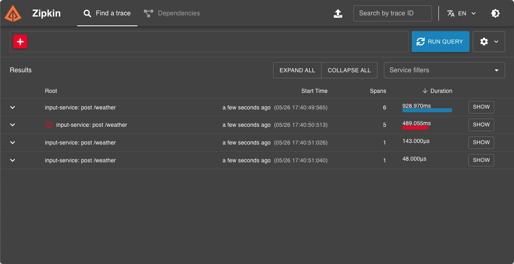
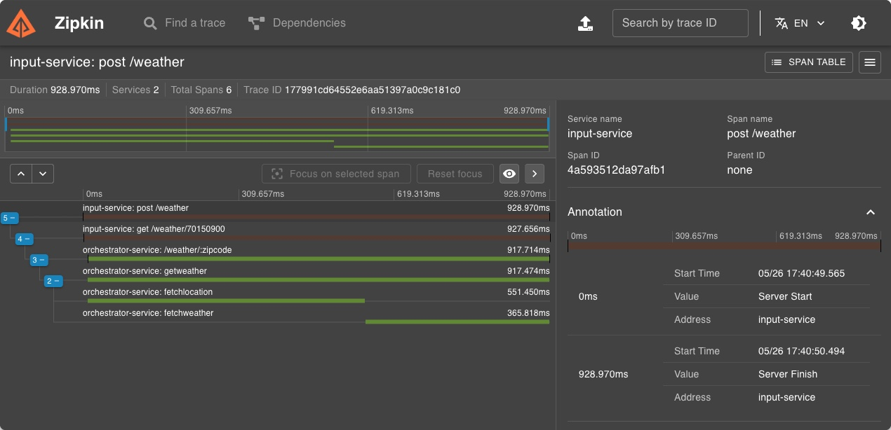

# Go Challenge: OTEL Distributed Tracing + Zipkin

Este projeto implementa arquitetura de microserviços para um Sistema de Previsão do Tempo que recebe um CEP, identifiqua a cidade e retorna o clima atual (temperatura em graus Celsius, Fahrenheit e Kelvin) juntamente com a cidade. Esse sistema implementa OTEL (Open Telemetry) e Zipkin para tracing distribuído.

## Cenário

Baseado no desafío [Go Challenge Google cloud Run: Weather API](https://github.com/rzeradev/google-cloud-run) aqui denominado Serviço B, será incluído um novo projeto, denominado Serviço A.

Para título de nomenclatura e organização no Zipkin, o Serviço B será denominado `orchestrator-service` e o Serviço A será será denomidado `input-service` para receber o input do usuário e encaminhar para o `orchestrator-service`.

## Requisitos

### Serviço A (Responsável pelo Input)

- Receber um input de 8 dígitos via POST, através do schema:
  ```json
  {
  	"cep": "29902555"
  }
  ```
- Validar se o input é válido (contém 8 dígitos e é uma STRING).
  - Caso seja válido, encaminhar para o Serviço B via HTTP.
  - Caso não seja válido, retornar:
    - Código HTTP: 422
    - Mensagem: `invalid zipcode`

### Serviço B (Responsável pela Orquestração)

- Receber um CEP válido de 8 dígitos.
- Realizar a pesquisa do CEP e encontrar o nome da localização.
- Retornar as temperaturas formatadas em Celsius, Fahrenheit e Kelvin, juntamente com o nome da localização.

#### Cenários de Resposta

- **Sucesso:**

  - Código HTTP: 200
  - Response Body:
    ```json
    {
    	"city": "São Paulo",
    	"temp_C": 28.5,
    	"temp_F": 83.3,
    	"temp_K": 301.65
    }
    ```

- **Falha - CEP Inválido (formato correto):**

  - Código HTTP: 422
  - Mensagem: `invalid zipcode`

- **Falha - CEP não encontrado:**
  - Código HTTP: 404
  - Mensagem: `can not find zipcode`

## Implementação do OTEL + Zipkin

- Implementar tracing distribuído entre Serviço A e Serviço B.
- Utilizar spans para medir o tempo de resposta do serviço de busca de CEP e busca de temperatura.

---

## Como Rodar o Projeto em Ambiente de Desenvolvimento

### Pré-requisitos

- Docker e Docker-compose instalados.

### Passos para Executar

1. Clone o repositório:

   ```bash
   git clone https://github.com/rzeradev/otel-zipkin
   cd otel-zipkin
   ```

2. Configure as variáveis de ambiente necessárias para o serviço B (verifique o arquivo `.env.example` e crie um `.env` com as suas configurações).

   ```bash
   cd service-b && cp .env.example .env
   # Modifique o arquivo .env como necessário
   # Adicione a sua própria chave Weather API
   ```

3. Execute o Docker-compose para subir os serviços:

   ```bash
   cd .. && docker-compose up --build
   ```

4. A aplicação estará disponível em `http://localhost:8080/weather`.

5. Para testar o Serviço A, utilize um cliente HTTP (como Postman ou curl) para enviar um `POST` request com o seguinte payload:

   ```json
   {
   	"cep": "29902555"
   }
   ```

   alternativamente rodar o arquivo `run_requests.sh` que irá disparar várias requests cURL para testar vários cenários

   ```bash
   chmod +x run_requests.sh && ./run_requests.sh
   ```

6. Verifique os traces no `Zipkin` disponível em `http://localhost:9411`.




### Observações

- Certifique-se de que as APIs externas utilizadas (viaCEP e WeatherAPI) estão acessíveis e com suas respectivas chaves configuradas.
- Ajuste os parâmetros de configuração de tracing e logging conforme necessário.
